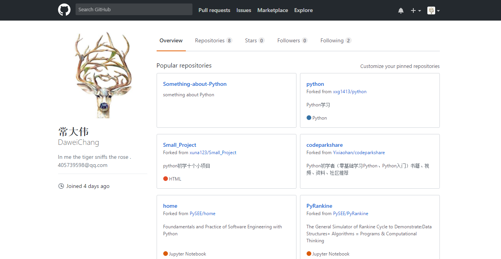
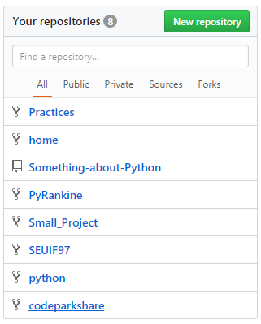
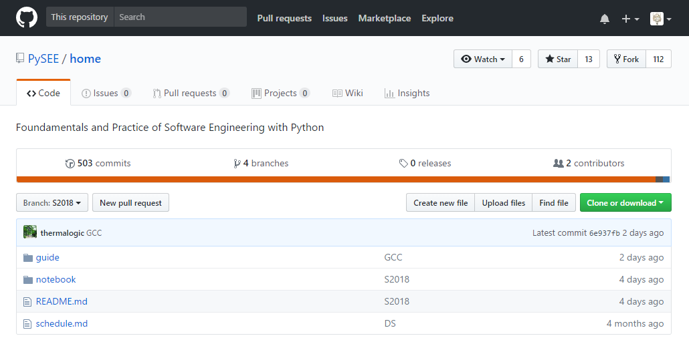
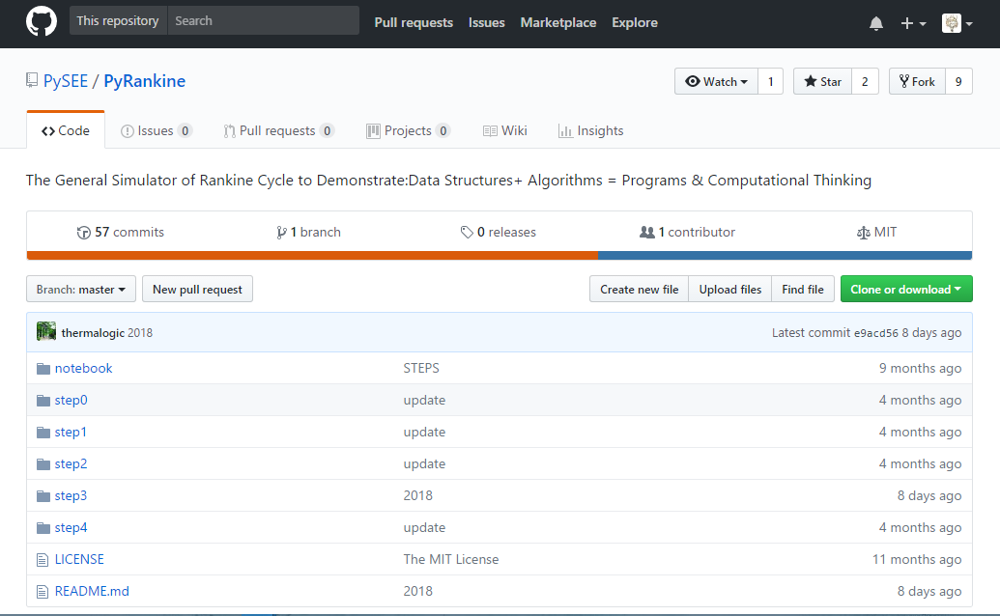
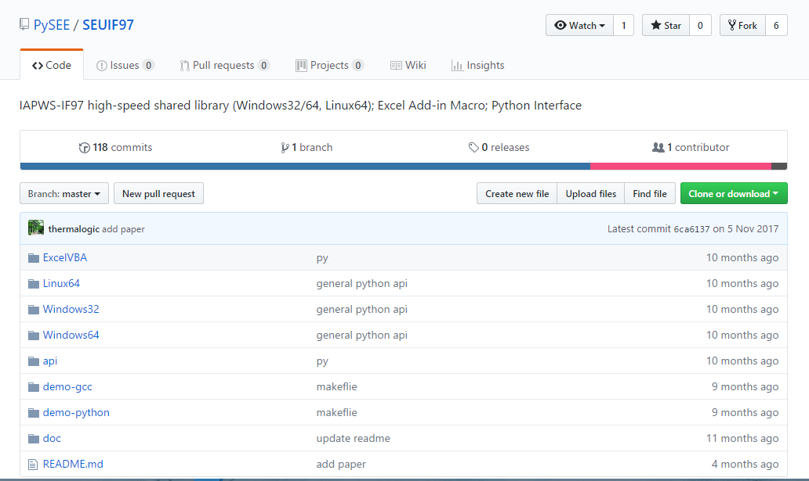

# 
 **Practice 1**
 

#### 
**03015318 常大伟**
 

## **1. 个人Github账户，账户名、使用的电子信箱，Github账户主页面截图**
* **(1) 个人Github账户**
  * Github账户：常大伟 DaweiChang

* **(2) 账户名、使用的电子信箱**

  * 账户名：DaweiChang

  * 电子邮箱：405739598@qq.com

* **(3) Github账户主页面截图**

 

 
 图1 主页截图
 

  
 

 图2 fork截图
 

## **2. Github简介**

* **(1) 什么是Github**

&nbsp; &nbsp; &nbsp; &nbsp; GitHub是一个面向开源及私有软件项目的托管平台，同时也是有社交功能的开发者社区。GitHub使用 git分布式版本控制系统，而git最初是Linux Torvalds为帮助Linux开发而创造的，它针对的是 Linux平台，用于管理Linux系统的源代码。GitHub采用的分布式版本控制系统解决了CVS、SVN等集中式系统依赖于联网和运行速度慢的缺点，为开源项目免费提供Git存储，有着极大的优越性。

* **(2) 基本功能**

&nbsp; &nbsp; &nbsp; &nbsp; 于2008年正式上线的GitHub除了Git代码仓库托管及基本的 Web 管理界面以外，还提供了订阅、讨论组、文本渲染、在线文件编辑器、协作图谱（报表）、代码片段分享（Gist）等功能。此外GitHub已经有了一些引人注目的功能，除了命令式的库浏览器和一个项目Wiki，GitHub甚至还包括了一个GitHub gem，以使通过shell方式使用GitHub更为方便。

* **(3) 优越性**

&nbsp; &nbsp; &nbsp; &nbsp; GitHub以代码开源为基础，使参与开源软件社区的离散个人和团队采用合作的方式,发挥了资源的最优配置、提高了资源的利用效率。

&nbsp; &nbsp; &nbsp; &nbsp; **a.** GitHub可以托管各种git库，并提供一个web界面，并且从另外一个项目进行分支十分简单。为一个项目贡献代码非常简单：首先点击项目站点的“fork”的按钮，然后将代码检出并将修改加入到刚才分出的代码库中，最后通过内建的“pull request”机制向项目负责人申请代码合并。

&nbsp; &nbsp; &nbsp; &nbsp; **b.** 作为一个分布式的版本控制系统，在Git中并不存在主库这样的概念，每一份复制出的库都可以独立使用，任何两个库之间的不一致之处都可以进行合并。与集中式相比有着更高的安全性，保证了开发环境的稳定性且无需联网运行。

&nbsp; &nbsp; &nbsp; &nbsp; 作为开源代码库以及版本控制系统，Github拥有超过900万开发者用户。随着越来越多的应用程序转移到了云上，Github已经成为了管理软件开发以及发现已有代码的首选方法。

## **3. 课程Home、PyRankine和SEUIF97仓库简介**
&nbsp; &nbsp; &nbsp; &nbsp; Home、PyRankine和SEUIF97为三个“Repository”，可以选择Watching，表示以后会关注这个项目的所有动态，这个项目以后只要发生变动，如被别人提交了 pull request、被别人发起了issue等等情况，都可以在自己的个人通知中心，收到一条通知消息；也可以选择 fork，相当于拥有了一份原项目的拷贝，但是这个拷贝只是针对当时的项目文件，如果后续原项目文件发生改变，必须通过其他的方式去同步。

* **(1) Home仓库简介**

&nbsp; &nbsp; &nbsp; &nbsp; Home仓库内的文件主要是介绍本门课程、指导学生安装和学习Python软件以及有效利用GitHub的学习资源。Home仓库内有guide、notebook等子文件夹，其中README.md是默认打开的，打开Home文件夹，README中的内容会自动在下方显示，其内容为介绍该课程的目的、参考书目、课程评分等。guide文件夹中有关于安装Python的工作环境和MarkDown的简单语法，notebook文件夹中包含可供学习和参考的代码。

 

 图3 home截图
 

* **(2) PyRankine仓库简介**

&nbsp; &nbsp; &nbsp; &nbsp; PyRankine仓库中有演示朗肯循环的通用模拟器的相关代码和教程，如朗肯循环模拟器的分步编码示例、参考书目和教程等，便于对Python编程的熟悉和对朗肯循环的进一步了解。

 

 图4 PyRinkine截图
 

* **(3) SEUIF97仓库简介**

&nbsp; &nbsp; &nbsp; &nbsp; SEUIF97仓库中有热力计算相关的文件和代码，是基于水和水蒸汽热力性质的通用计算模型的公式IF97的共享库，以便于在模拟计算水和水蒸汽性质，如计算流体动力学（CFD）、热循环计算、非稳态过程的模拟和实时过程的优化，快速调用IAPWS-IF97，提高运算速度。文件中提供了对Python、Windows及Linux不同平台的相应代码。

 

 图5 SEUIF97截图
 